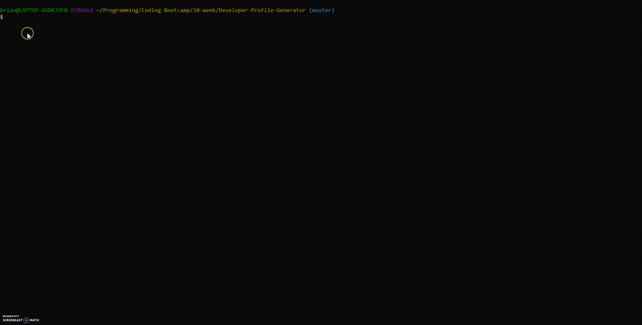

# Developer-Profile-Generator
A command-line application that dynamically generates a PDF profile from a GitHub username

Initial Install:
1. Run npm install
2. Go to "node_modules/convert-html-to-pdf/lib/index.js" and change last line from exports.default to module.exports *** bug fix ***
3. Run node index.js

A PDF will be populated with the following:

* Profile image
* User name
* Links to the following:
  * User location via Google Maps
  * User GitHub profile
  * User blog
* User bio
* Number of public repositories
* Number of followers
* Number of users following